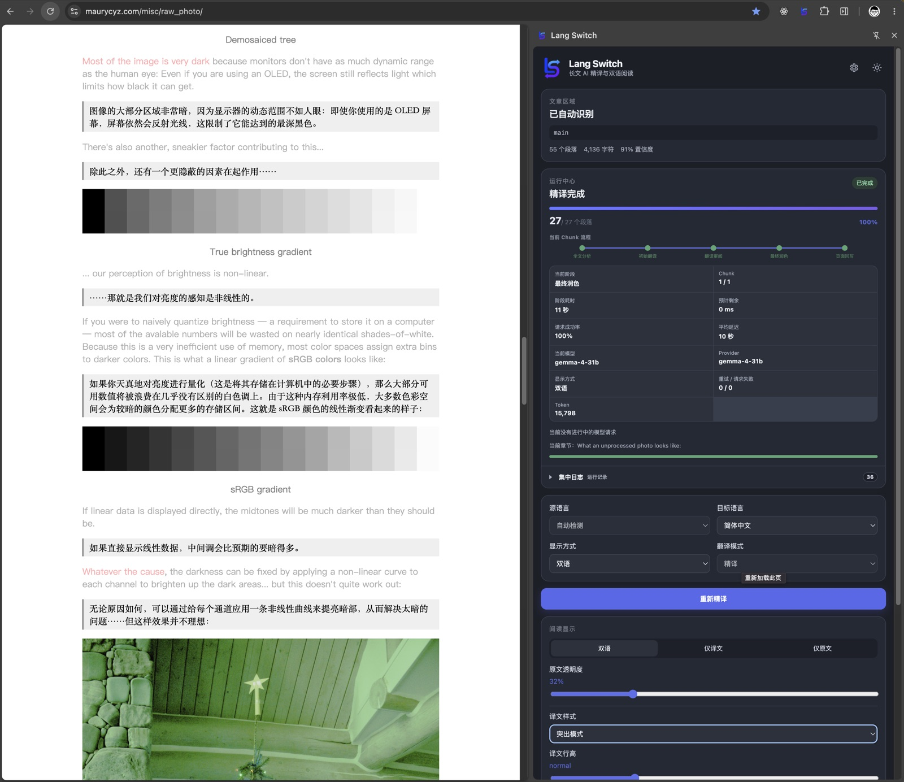
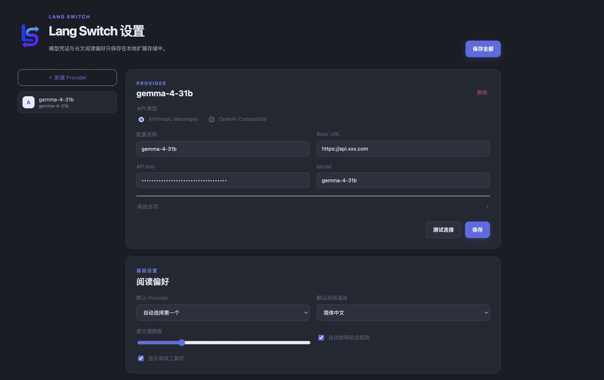

<p align="center">
  
</p>

<h1 align="center">Lang Switch</h1>

<p align="center">
  面向技术博客、论文和专业长文的 AI 精译 Chrome 扩展<br />
  保留上下文、统一术语，让双语阅读更自然
</p>

<p align="center">
  
  
  
</p>

> Chrome 自带翻译适合快速浏览，但遇到专业长文时，专有名词、上下文和作者语气常常会被翻译得生硬。Lang Switch 把文章当作一篇完整内容来理解，再分段翻译和润色，并在原文下方保留译文，帮助你读懂技术文章，而不是只得到逐句替换的结果。

| | Chrome 自带全文翻译 | Lang Switch |
| --- | --- | --- |
| 适合场景 | 快速了解网页大意 | 深度阅读技术博客、论文和专业长文 |
| 翻译方式 | 逐句替换 | 全文分析 → 分块初译 → 审阅 → 润色 |
| 上下文 | 主要看当前句子 | 使用前后文、术语表和滚动译文记忆 |
| 阅读结果 | 覆盖原文 | 原文下方插入译文，可切换双语/仅译文 |

## 目录

- [为什么做 Lang Switch](#为什么做-lang-switch)
- [界面预览](#界面预览)
- [核心能力](#核心能力)
- [精译流程：借鉴 Translation Agent](#精译流程借鉴-translation-agent)
- [快速开始](#快速开始)
- [Provider 配置](#provider-配置)
- [隐私与安全](#隐私与安全)
- [技术实现](#技术实现)
- [本地开发](#本地开发)
- [已知限制](#已知限制)

## 为什么做 Lang Switch

### Chrome 自带翻译的问题

全文翻译在日常网页上很方便，但专业文章通常需要更强的上下文能力：

- `React`、`WebAssembly`、人名、产品名等实体不应该被直译或反复变换；
- 同一个术语在不同段落需要保持一致；
- 代词、指代、转折和技术限定依赖前后文，逐句翻译很容易失去关系；
- 论文和博客的叙述节奏、比喻与作者语气，不适合机械地替换词语。

### Lang Switch 的做法

Lang Switch 面向“认真读完一篇文章”的场景：先分析全文主题、受众、语气和术语，再按标题边界分块；每个分块都带有受限的前后文和已完成译文记忆，经过初译、审阅和最终润色后，逐段回写到页面。

它不试图成为所有网页元素的通用翻译器，也不翻译按钮、菜单、表单、评论区或代码块。目标很简单：让技术内容读起来像一篇连贯的中文文章，同时保留原文对照。

## 界面预览

### 主界面：在原文下方渐进显示双语译文

<p align="center">
  
</p>

Side Panel 会显示文章识别结果、当前阶段、Chunk 进度、请求状态和阅读显示设置。译文以相邻段落插入原文下方，不移动或替换原页面内容。

### 配置界面：连接任意兼容的模型服务

<p align="center">
  
</p>

可以保存多个 Provider，选择默认模型、目标语言、原文透明度和站点规则。API Key 只保存在浏览器扩展的本地存储中。

## 核心能力

### 更可靠的文章识别

- 自动评估 `article`、`main`、`[role="main"]` 等候选区域的正文规模、标题/段落数量、链接密度、导航和表单特征。
- 识别置信度不足时先提示用户，不会悄悄翻译错误区域。
- 高级模式支持点击选区、CSS Selector 校验/预览，以及按站点和文章路径保存规则。
- 对 SPA URL 变化、延迟加载和文章区域内的 DOM 变化提供基础处理。

### 面向长文的上下文翻译

- 翻译前提取标题层级、段落、列表、引用、表格和图注；代码块默认跳过。
- 按标题边界和 Token 预算切分 Chunk，避免一次请求塞入整篇文章。
- 每个 Chunk 只允许输出带稳定段落 ID 的目标内容，防止上下文被误当成译文。
- 持久化已完成译文，暂停、恢复或 Service Worker 重启后仍能延续术语和文风。

### 可控的阅读体验

- 双语、仅译文、仅原文三种模式；可调节原文透明度。
- 支持暂停、继续、停止、恢复页面，以及单段复制和单段重译。
- 运行中心展示当前阶段、Chunk、重试、超时、HTTP 状态、平均延迟、成功率、Token 和预计剩余时间。
- 每个 Chunk 独立失败，不会抹掉已经完成的译文；日志可筛选并复制脱敏诊断信息。

### Markdown 与媒体导出

- 导出原文、译文或双语 Markdown，保留标题、列表、引用、表格、代码、图片和图注等结构。
- 可选下载图片、HTML5 视频、Poster 和音频，改写为 `media/` 相对路径并生成 ZIP。
- 导出和 ZIP 构建在浏览器本地完成，不经过扩展开发者服务器。

## 精译流程：借鉴 Translation Agent

项目实践了 [Andrew Ng 的 translation-agent](https://github.com/andrewyng/translation-agent) 所倡导的“初译 → 反思/审阅 → 改进”模式，并针对浏览器长文做了结构化改造：

```text
全文分析
  ↓ 主题、摘要、领域、受众、语气、术语表、命名实体
分块与上下文窗口
  ↓ 标题边界 + Token 预算 + 前后文 + 滚动译文记忆
初始翻译
  ↓ 保留事实、技术限定、比喻、幽默和段落节奏
Chunk 级审阅
  ↓ 检查误译、术语一致性、机械直译、衔接和作者声音
最终润色
  ↓ 根据审阅意见真正重写译文，而非简单替换同义词
安全回写页面
  ↓ 按稳定段落 ID 插入原文下方，可随时恢复原页面
```

这里的“反思”不是让模型为每句话生成一段泛泛的解释，而是把整个 Chunk 当作连续文章检查，再把可执行的改进意见交给最终润色阶段。完整原文不会在每次请求中重复发送：扩展使用有界前后文和滚动记忆，在控制成本的同时保持上下文连续性。

## 快速开始

### 1. 构建并加载扩展

环境要求：Node.js 20.19+ 或 22.12+、pnpm 10+、Chrome 116+。

```bash
pnpm install
pnpm build
```

然后在 Chrome 中：

1. 打开 `chrome://extensions`，开启“开发者模式”；
2. 点击“加载已解压的扩展程序”；
3. 选择项目生成的 `dist/` 目录。

修改源码后重新执行 `pnpm build`，并在扩展管理页点击“重新加载”；修改 Content Script 后还需要刷新目标文章页面。

### 2. 配置模型 Provider

打开扩展设置页，新增一个 Provider，填写 API 类型、Base URL、Model 和 API Key，点击“测试连接”后保存。支持：

- OpenAI Compatible（`/chat/completions`）；
- Anthropic Messages（`/v1/messages`，Base URL 已含 `/v1` 时会避免重复路径）；
- OpenRouter、公司内部网关等兼容服务；高级选项还可配置完整 Endpoint、自定义 Headers、Temperature、最大输出 Token、超时和并发数。

### 3. 翻译一篇文章

打开技术博客、论文或设计文档，点击扩展图标打开 Side Panel：

1. 确认自动识别出的文章区域；必要时进入高级模式选择区域；
2. 选择源语言、目标语言、显示方式和翻译模式；
3. 点击“开始精译”，等待各 Chunk 按顺序完成；
4. 在阅读过程中暂停、重译单段或导出 Markdown。

## Provider 配置

### OpenAI Compatible

```text
API 类型：OpenAI Compatible
Base URL：https://api.openai.com/v1
Model：你的模型名称
```

默认请求地址为 `{baseUrl}/chat/completions`。OpenAI Compatible 适配器会对 GPT-5 系列使用 `max_completion_tokens`，并省略该系列不支持的自定义 `temperature`；其他兼容模型使用通用的 `max_tokens` 和 Temperature 设置。

### Anthropic Messages

```text
API 类型：Anthropic Messages
Base URL：https://api.anthropic.com
Model：你的 Claude 模型名称
Anthropic Version：2023-06-01
```

默认请求地址为 `{baseUrl}/v1/messages`。

### 自定义网关注意事项

模型服务的可用模型、CORS/扩展访问策略、速率限制和数据保留政策由服务提供方决定。需要访问新的 API 域名时，扩展只会在用户点击“开始精译”或“测试连接”后请求对应权限。

## 隐私与安全

> 被翻译的文章文本会发送到你配置的模型 API 服务。请在使用前阅读该服务的条款和隐私政策。

- 请求可能包含页面标题、URL、文章结构、待翻译段落、术语表和翻译要求；不会包含页面 Cookie、表单输入、密码框、页面脚本状态或扩展 API Key。
- Content Script 不读取 Provider 配置；模型请求经由 `chrome.runtime` 消息转发到 Background Service Worker。
- API Key 只存储在 `chrome.storage.local` 的受信任扩展上下文中，不写入 DOM、Prompt、缓存 Key、console 或错误消息。
- 诊断日志会脱敏，不保存文章正文、Prompt、认证 Header 或 API Key；最多持久化最近 1,000 条，Side Panel 默认显示当前任务最近 250 条。
- Markdown 转换、链接改写、媒体下载和 ZIP 生成均在本地浏览器完成。媒体请求不主动携带页面 Cookie，登录态或防盗链资源可能只能保留为远程链接。

## 技术实现

### 技术栈

- TypeScript 6、React 19、Vite 8
- Chrome Extension Manifest V3、Side Panel API
- Zod（跨模块消息和模型 JSON 校验）
- `fetch`、原生 DOM API、`fflate`（ZIP）
- Vitest + jsdom、ESLint flat config

### 主要模块

```text
src/
├─ background/       Service Worker、任务状态、Provider 调用、诊断与导出
├─ content/          文章识别、语义分段、区域选择、DOM 回写与 MutationObserver
├─ sidepanel/        翻译控制台、进度监控、显示设置、导出面板
├─ options/          Provider、阅读偏好和站点规则配置
└─ shared/
   ├─ api/           OpenAI Compatible / Anthropic 适配器
   ├─ translation/   分块、上下文窗口、Prompt、Pipeline、缓存
   ├─ export/        Markdown 序列化、媒体处理和 ZIP
   ├─ messaging/     Zod 消息 Schema
   └─ storage/       配置与任务持久化
```

原正文节点只增加 `ai-reader-translation-*` 前缀 class 和 `data-ai-reader-*` 属性；译文使用带 `data-ai-reader-inserted` 标记的相邻节点插入。点击恢复原页面时会清理扩展插入节点、样式变量和观察器，不重建原正文。

## 本地开发

```bash
# 同时监听 UI、Content Script 和 Service Worker，并输出到 dist/
pnpm dev

# 只预览 Side Panel / Options UI
pnpm dev:ui

# 完整检查
pnpm typecheck
pnpm lint
pnpm test
pnpm build
```

`pnpm dev:ui` 会在 `http://127.0.0.1:5173/` 提供普通网页预览，但该模式没有完整 Chrome Extension API，不用于验证翻译、存储或页面注入流程。

可选的真实 Provider 集成测试会读取被 Git 忽略的 `.env.local`，不会由默认测试触发：

```bash
pnpm test:provider
```

环境变量：`AI_READER_PROVIDER_BASE_URL`、`AI_READER_PROVIDER_API_KEY`、`AI_READER_PROVIDER_MODEL`。不要提交 `.env.local`，也不要在测试日志中打印 API Key。

## 已知限制

- 主要面向静态 HTML 长文章；无限滚动正文只提供基础 MutationObserver 支持，不自动翻译评论区。
- 暂不支持 PDF、OCR、Shadow DOM 内文章或跨源 iframe 正文。
- MVP 译文不会恢复原段落中的 `<strong>`、链接等行内样式。
- 站点彻底重建文章 DOM 后，已完成译文可能需要重新精译。
- 媒体下载受权限、登录态、防盗链、单文件 50 MB、总计 500 MB、最多 200 个资源和可用内存限制；YouTube、Vimeo、HLS、DASH、DRM、`blob:` 等视频不会被下载。
- 默认精译按顺序执行，以优先保证上下文衔接；并发设置可在 Provider 高级选项中持久化。

## 当前状态

翻译 Pipeline Phase 1–10 与 Markdown/媒体导出 Phase 1–9 的 MVP 路径已实现。自动测试覆盖文章识别、语义分段、Provider、结构化输出、缓存、任务状态、Markdown 元素、内容模式、媒体去重、失败隔离、文件命名和 ZIP 二进制完整性。

发布前建议在真实 Chrome 和常用站点上验证跨域媒体授权、下载以及大文件导出的内存占用。
